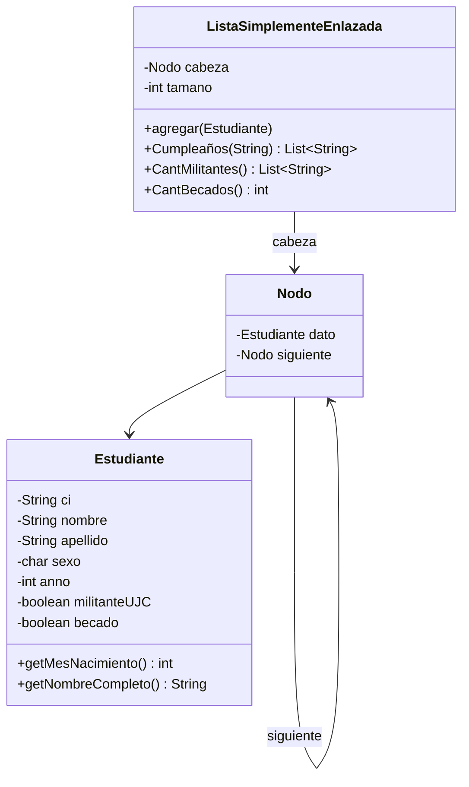

# ED
Ejercicio de lista de estudiantes
# Control de Estudiantes con Lista Simplemente Enlazada

## 1. ¿Qué problema resolví?

En el departamento de Informática se necesita un sistema para controlar los datos de los estudiantes. De cada estudiante guardo **CI**, **nombre**, **apellido**, **sexo**, **año**, si es **militante de la UJC** y si es **becado**. Para almacenarlos implementé mi propia **Lista Simplemente Enlazada** y le agregué tres métodos:

| Inciso | Método | Qué hace |
|--------|--------|----------|
| a) | `Cumpleaños(String mes)` | Devuelve los nombres de los estudiantes que cumplen años en el mes indicado |
| b) | `CantMilitantes()` | Devuelve la información de los militantes de la UJC ordenada por año, de menor a mayor |
| c) | `CantBecados()` | Devuelve la cantidad de estudiantes becados |

## 2. Estructura del proyecto

```
src/
├── Estudiante.java                (datos del estudiante)
├── Nodo.java                      (dato + referencia al siguiente)
├── ListaSimplementeEnlazada.java  (la lista y los 3 métodos)
└── Main.java                      (casos de prueba)
```

## 3. Diagrama de clases



Así se ve la lista en memoria:

```
cabeza → [Ana|2do|UJC] → [Luis|1ro|UJC] → [María|3ro] → null
```

## 4. Cómo lo hice

### Estudiante y Nodo
Creé la clase `Estudiante` con los siete atributos del enunciado y un `toString()` para imprimirlo fácil. Como el enunciado no trae la fecha de nacimiento, decidí sacar el **mes de nacimiento del CI**: en el carné cubano los dígitos 3 y 4 son el mes. Por eso hice el método `getMesNacimiento()`, que lee esas dos posiciones y las convierte en número. Después hice la clase `Nodo`, que guarda un `Estudiante` y la referencia al siguiente nodo.

### ListaSimplementeEnlazada
Guardé la referencia a la `cabeza` y un contador `tamano`. Implementé `agregar()`, que recorre la lista hasta el último nodo y enlaza el nuevo ahí, para respetar el orden de inserción.

### a) Cumpleaños(String mes)
Primero convertí el mes recibido a número. Hice que acepte el nombre ("Marzo", "marzo", "MARZO") o el número ("03" o "3"), y le quité las tildes y las mayúsculas al texto para que "Septiembre" o "septiembre" funcionen igual. Si el mes no es válido, devuelvo una lista vacía. Luego recorrí la lista con un puntero `actual` y guardé el nombre completo de cada estudiante cuyo mes de nacimiento coincide.

### b) CantMilitantes()
Recorrí la lista y, solo para los estudiantes militantes de la UJC, hice una **inserción ordenada** en una lista auxiliar: avanzo mientras los que ya están tengan año menor o igual al del nuevo. Así obtuve el orden de menor a mayor sin alterar mi lista original, y los estudiantes del mismo año conservan el orden en que los inserté. Al final convertí cada estudiante a texto y devolví el listado.

### c) CantBecados()
Recorrí la lista con un contador y lo incrementé cada vez que encontré un estudiante becado. Al terminar devolví el contador.

## 5. Casos de prueba

Los hice en `Main.java` y cubrí tres situaciones:

1. **Lista con datos variados**: usé seis estudiantes con meses, años, militancia y beca distintos. Probé `Cumpleaños` con el nombre del mes ("Marzo"), con el número ("07") y con un mes sin cumpleaños ("diciembre"). También comprobé que dos militantes del mismo año (1ro) conserven su orden de inserción.
2. **Lista vacía**: comprobé que mis tres métodos no fallen y devuelvan vacío o cero.
3. **Sin militantes ni becados**: verifiqué que `CantMilitantes()` devuelva una lista vacía y `CantBecados()` devuelva 0.

En cada prueba comparé el resultado contra el valor esperado y el programa imprime `OK` o `FALLO`.

### Salida del caso 1

```
-- Cumpleaños("Marzo") --
[Ana Pérez, María Díaz, Elena Torres]
Esperado: [Ana Pérez, María Díaz, Elena Torres] -> OK

-- CantMilitantes() (año de menor a mayor) --
04071554321 | Luis Gómez | Sexo: M | Año: 1 | UJC: Sí | Becado: No
06030345678 | Elena Torres | Sexo: F | Año: 1 | UJC: Sí | Becado: No
05030112345 | Ana Pérez | Sexo: F | Año: 2 | UJC: Sí | Becado: Sí
02110234567 | Carlos Ruiz | Sexo: M | Año: 4 | UJC: Sí | Becado: Sí

-- CantBecados() --
3
```

## 6. Cómo ejecutarlo

```bash
cd src
javac -encoding UTF-8 *.java
java Main
```

Usé UTF-8 porque el nombre del método `Cumpleaños` lleva ñ y los datos llevan tildes.

## 7. Complejidad

- `agregar()`: recorro toda la lista para insertar al final, así que es **O(n)**.
- `Cumpleaños()` y `CantBecados()`: hago un solo recorrido, **O(n)**.
- `CantMilitantes()`: hago una inserción ordenada por cada militante, **O(n²)** en el peor caso.
